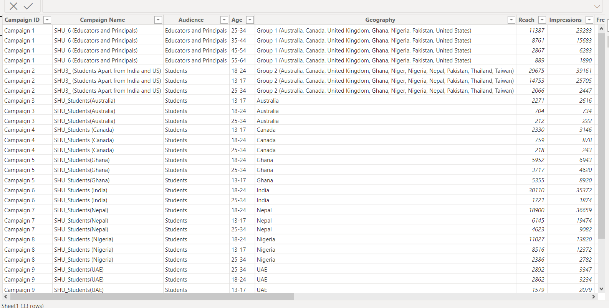
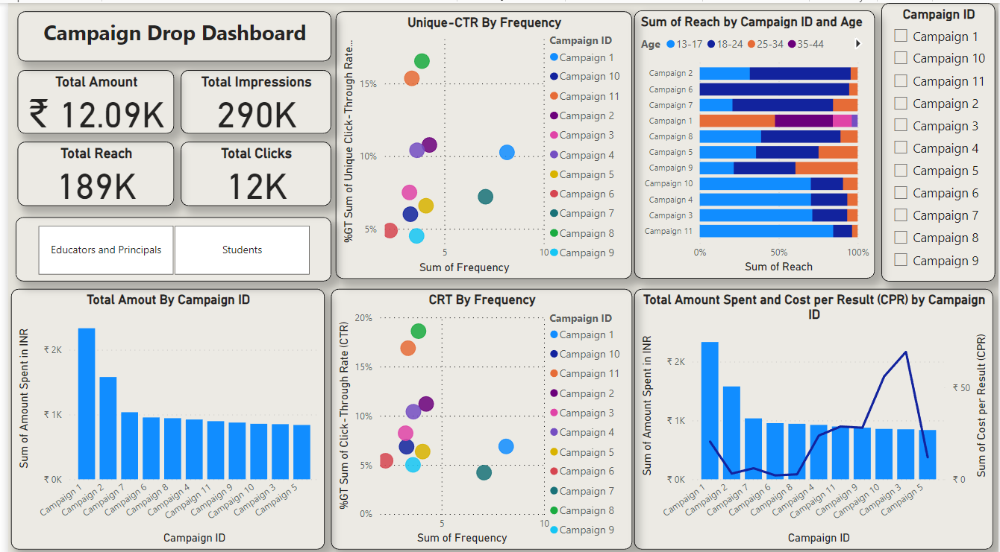
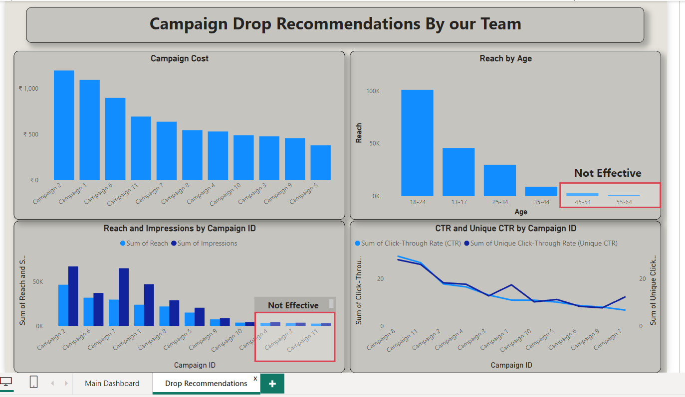
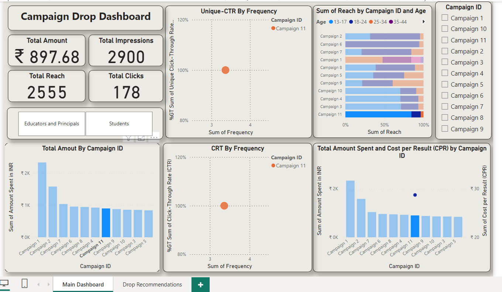
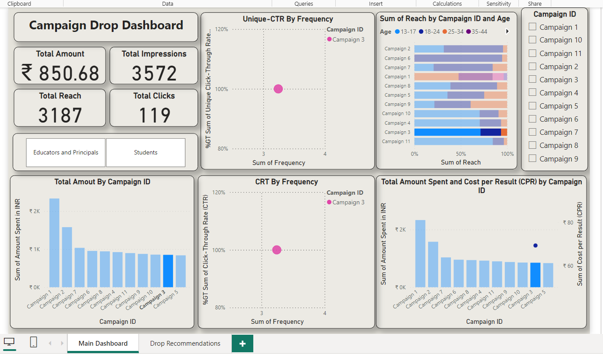

# Ad-Campaign-Dashboard

## Introduction

The Ad-Campaign Drop Dashboard project aims to analyze and visualize data related to marketing ad campaigns. This document provides an overview of the project, including the problem statement, skills utilized, data sourcing, data transformation, modeling, analysis and visualizations, and concluding recommendations.

## Problem Statement

The primary objective of this project is to gain insights from marketing ad campaign data and present them in an informative dashboard format. The analysis will focus on key performance indicators (KPIs) related to ad campaign performance, including total spent amount, reach, impressions, clicks, Unique-click through rate (Unique-CTR), and Click Through Rate (CTR).

## Skills Utilized

     •	Data Analysis

     •	Data Transformation

     •	Data Modeling

     •	Data Visualization

     •	Excel (for data extraction)

     •	Dashboard Creation (e.g.Excel, Power BI, etc.)

## Data Sourcing

The dataset used for this project is sourced from the Excelerate Global Internship portal, where data related to various marketing ad campaigns is stored. The dataset includes information about the amount spent, reach, impressions, clicks, and other relevant metrics for each campaign.

Data Source: Excelerate Global Internship Portal

## Data Transformation

The initial dataset will undergo various data transformation steps to make it suitable for analysis and modeling. 

These steps may include:

      •	Cleaning and handling missing data

      •	Formatting data types

      •	Calculating derived metrics (Unique-CTR, CTR, etc.)
      

## Data Modeling

Since this project involves analyzing marketing data, traditional data modeling might not be necessary. However, data manipulation for analysis purposes may involve the creation of calculated fields and aggregations.

## Analysis & Visualizations

The analysis will include calculations of key performance indicators (KPIs) such as total spent amount, reach, impressions, clicks, Unique-CTR, and CTR. The visualizations will be created using Python libraries like Matplotlib, Seaborn, and Plotly. Additionally, you can use dashboard creation tools like Tableau or Power BI to build an interactive dashboard.
Visualizations may include:

•	scatter or a bubble plot For analyzing relationships between variables.

•	stacked Bar charts for comparisons between campaigns

•	Scatter Chart to visualize the distribution of ad types

•	Line and Stacked Column  for exploring relationships between metrics

## Conclusion / Recommendations

Based on the analysis and visualizations, the project concludes with key takeaways and recommendations. Here are some specific recommendations for Campaign 1 and Campaign 2

### Campaign 11: Low Impressions with High Spending

•    While the campaign exhibits substantial expenditure, the generated impressions and reach appear disproportionately low.

•    An in-depth review of targeting parameters is recommended to ensure alignment with the intended audience.

•    Consider optimizing ad content and visuals to heighten engagement and increase impressions.

### Campaign 3: High Reach but Low Clicks

•     Despite achieving a commendable reach, the campaign records low click-through rates.

•     A detailed assessment of ad content and call-to-action elements is advised to identify potential areas for improvement.

•     Vigilance against click fraud or malicious activity is essential to avoid artificial inflation of reach without genuine engagement.

Remember to consider these recommendations in the context of the data and analysis. Further investigation may be needed to validate these assumptions and make informed decisions.

## Getting Started
To explore the Ad-Campaign Drop Dashboard project:

1.	Clone this repository to your local machine.
2.	
3.	Set up the required environment and dependencies using the provided requirements.txt file.
4.	
5.	Run the data transformation and analysis scripts to prepare the data and generate insights.
6.	
7.	Create visualizations and interactive dashboards using Python libraries or dashboard tools of your choice.

## Credits

This project was created by JATIN KATIYAR.

•	GitHub :  github.com/chaseyuvi 
  
Feel free to adjust the recommendations and other details to match your project's specifics and your observations from the analysis.
 Note:- 
  Please share your suggestions and thoughts to help me correct my insights.

